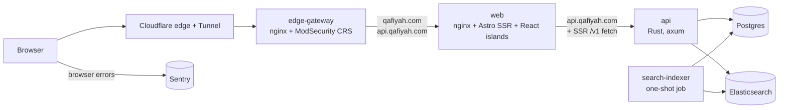

<picture>
  <source media="(prefers-color-scheme: dark)" srcset=".github/readme_banner_darkmode.webp">
  <source media="(prefers-color-scheme: light)" srcset=".github/readme_banner_lightmode.webp">
  
</picture>

<p align="center">
  <picture>
    <source media="(prefers-color-scheme: dark)" srcset=".github/readme_tagline_darkmode.svg">
    <source media="(prefers-color-scheme: light)" srcset=".github/readme_tagline_lightmode.svg">
    
  </picture>
</p>

<p align="center">
  <a href="https://qafiyah.com"></a>
  <a href="https://api.qafiyah.com/v1/docs"></a>
  <a href="data/db"></a>
  <a href="LICENSE"></a>
  <a href="data/LICENSE"></a>
</p>

Qafiyah is an open-source reference for Arabic poetry. At [qafiyah.com](https://qafiyah.com), you can search every verse for a word or a phrase. You can also browse by poet, meter, rhyme, era, and theme. The code, the data, and a free JSON API are all public, and [contributions are welcome](#contributing).

|   Poems |    Verses |  Poets | Meters | Rhymes | Eras | Themes | Collections |
| ------: | --------: | -----: | -----: | -----: | ---: | -----: | ----------: |
| 349,059 | 5,888,903 | 17,342 |     44 |     36 |   12 |     10 |           1 |

<sub>From snapshot <code>0039_06_10_2026</code>. Verses counts each stored line of a poem. Poets, eras, and meters each count one "unknown" entry for unattributed records.</sub>

<p align="center">
  
  
</p>

## Try it

**Read.** Browse [qafiyah.com](https://qafiyah.com), or follow [@qafiyahx](https://x.com/qafiyahx) on X for a poem a day.

**Ask the API.** You need no key and no sign-up:

```bash
curl "https://api.qafiyah.com/v1/poems/random?option=lines"
```

**Run it locally.** You need [Bun](https://bun.sh) 1.4.2, a Docker engine ([OrbStack](https://orbstack.dev) or Docker Desktop), [rustup](https://rustup.rs), and Bash 4 or later. Install Bun first, then run:

```bash
git clone https://github.com/raaqimorg/qafiyah.git
cd qafiyah
bun install
bun run doctor
bun run dev
```

`bun run doctor` checks every other tool and its version, and prints the command that fixes each problem. `bun run dev` runs the same check first.

The first run starts Postgres and Elasticsearch in Docker, restores a 100-poem sample, and builds the search index. It needs no `.env` file and no secrets. The site is then at http://localhost:4321, and the API is at http://localhost:8787. For everyday commands and troubleshooting, see [`docs/development.md`](docs/development.md).

## API

`https://api.qafiyah.com/v1` serves read-only JSON for poems, poets, eras, meters, rhymes, themes, collections, and full-text search. To explore it, open the [interactive docs](https://api.qafiyah.com/v1/docs), the [OpenAPI document](https://api.qafiyah.com/v1/openapi.json), or [llms.txt](https://api.qafiyah.com/llms.txt).

| Access   | Limit                                                                            |
| -------- | -------------------------------------------------------------------------------- |
| No key   | 60 requests per hour per address (an IPv6 /64 is one address)                    |
| Free key | 500 requests per hour, at most 10 per second and 1,500 per hour from one address |
| Higher   | write to [api@qafiyah.com](mailto:api@qafiyah.com)                               |

To create a key, sign in with Google or GitHub on the [developers page](https://qafiyah.com/developers). Send the key in the `x-api-key` header. The API treats a key that it does not recognize as no key.

Every response, including an error, reports `x-ratelimit-limit`, `x-ratelimit-remaining`, and `x-ratelimit-reset`. A refused request gets 429, and a temporarily overloaded API answers 503. Both come with `Retry-After`. Errors are RFC 9457 problem+json, and the `detail` of a 400 names the wrong parameter.

## Data

Postgres is the source of truth. Elasticsearch is a search index that is rebuilt from it. Poet avatars come from Cloudflare R2 at `cdn.qafiyah.com`. This repo keeps versioned snapshots: database dumps in [`data/db/`](data/db/README.md), and avatar archives in [`data/avatars/`](data/avatars/README.md).

The 100-poem sample that `bun run dev` restores is plain text. The full snapshots are encrypted, but they are free for anyone. To get a passphrase, email [dumps@qafiyah.com](mailto:dumps@qafiyah.com) or [avatars@qafiyah.com](mailto:avatars@qafiyah.com) and say what you plan to build. The passphrase comes back quickly, with no vetting. The encryption only lets us withdraw a record later, because a plaintext file pushed to a public repo stays in every clone. For details, see [`data/README.md`](data/README.md).

## How it works

A request enters through Cloudflare, passes the web application firewall, and reaches the web app or the API. The web app renders pages on the server, and it calls the API to do so. The API reads records from Postgres and searches Elasticsearch.



| Part                                                     | Role                                                                                | Built with                                |
| -------------------------------------------------------- | ----------------------------------------------------------------------------------- | ----------------------------------------- |
| [`apps/web`](apps/web/AGENTS.md)                         | Server-rendered pages, with React islands for search, the random poem, and settings | Astro, React, Tailwind CSS, Bun, PostHog  |
| [`apps/api`](apps/api/AGENTS.md)                         | Read-only `/v1` API, its OpenAPI contract generated from the code                   | Rust, axum, Diesel, utoipa, PostgreSQL 18 |
| [`apps/search-indexer`](apps/search-indexer/AGENTS.md)   | One-shot job that builds a fresh index from Postgres and swaps the alias            | Rust, Diesel, Elasticsearch 9             |
| [`crates/elasticsearch`](crates/elasticsearch/AGENTS.md) | Index schema, Arabic analyzers, and client shared by the two above                  | Rust                                      |
| [`crates/corpus`](crates/corpus/AGENTS.md)               | Diesel schema of the corpus database, shared by the API and the indexer             | Rust, Diesel                              |
| [`apps/edge-gateway`](apps/edge-gateway/AGENTS.md)       | Web application firewall in front of everything, configuration only                 | nginx, OWASP ModSecurity CRS              |
| [`apps/inspector`](apps/inspector/AGENTS.md)             | Dev-only report of the metadata on every page type                                  | TypeScript                                |
| [`scripts/`](scripts/AGENTS.md)                          | Repo tooling and the CI gate, one `bun run` name per entry point                    | Bun, Turborepo, oxlint, oxfmt, vitest     |

Search reads Arabic the way people do. Hamza forms, alif maqsura, and ta marbuta fold to their base letters. Matching ignores diacritics, and the display keeps them. An exact title always ranks above scattered matches. For the full account, see [`docs/search.md`](docs/search.md).

Production is one VPS behind a Cloudflare Tunnel, and nothing on it is reachable from outside. It runs fourteen containers: the site, its data stores, and a private observability stack. A deploy is a manual step. [`docs/topology.md`](docs/topology.md) maps the whole system, and [`docs/deployment/`](docs/deployment/README.md) covers operations.

## Contributing

Report bugs and ideas in [GitHub issues](https://github.com/raaqimorg/qafiyah/issues). To change code, do these steps:

1. Open an issue.
2. Fork the repo, and branch off the open version branch (`v` and a number, such as `v2`).
3. Run `bun run ci`.
4. Open a pull request into that branch, linked to the issue.

[`CONTRIBUTING.md`](.github/CONTRIBUTING.md) gives the full steps. Good places to start are the web app, search relevance, and the repo tooling. Every component has an `AGENTS.md` that describes its shape. [`docs/exceptions.md`](docs/exceptions.md) lists where the code is different from the usual approach, and why.

<details>
<summary><b>What <code>bun run ci</code> checks</b></summary>
<br>

[`scripts/ci.ts`](scripts/ci.ts) runs lint and format, type and repo checks, unit tests, and contract snapshots (OpenAPI, the generated client, Elasticsearch queries). With Docker, it then runs the database-backed tests and the smoke tests against the built stack.

The pre-commit hook checks only the staged files. The pre-push hook runs the gate without Docker. GitHub Actions runs the gate and gitleaks on every push and pull request. It runs each Docker phase only when the change touches what that phase uses ([`docs/topology.md`](docs/topology.md), "CI/CD topology"). Clippy refuses `unwrap`, `expect`, `panic`, indexing, and lossy casts in production code. For more, see [`docs/testing.md`](docs/testing.md).

</details>

<details>
<summary><b>Documentation map</b></summary>
<br>

- [`docs/development.md`](docs/development.md): how to run the stack locally, everyday commands, worktrees, and committing.
- [`docs/topology.md`](docs/topology.md): a diagram-first map of the whole system, both code and production. It is drawn from the C4 model in [`docs/architecture/workspace.dsl`](docs/architecture/workspace.dsl).
- [`docs/deployment/README.md`](docs/deployment/README.md): the production entry point.
- [`docs/changelog/`](docs/changelog/): what each released version changed, one file per version.
- [`docs/domain.md`](docs/domain.md): what a poem, poet, meter, rhyme, era, theme, and collection mean.
- [`docs/search.md`](docs/search.md): Arabic text handling, relevance tiers, and snippet selection.
- [`docs/code-conventions.md`](docs/code-conventions.md) and the TypeScript, Rust, testing, and pull request files next to it: how to write code, tests, docs, and commits.
- [`docs/identity.md`](docs/identity.md): canonical name, description, organization, and links.
- [`AGENTS.md`](AGENTS.md) and each component's `AGENTS.md`: the repo layout and the shape of each component. They are written for AI agents, and they are useful to anyone.
- [`data/README.md`](data/README.md): the encrypted database and avatar snapshots.

</details>

## Contact

[Raaqim](https://raaqim.org) maintains Qafiyah, together with its contributors. Raaqim is an open-source organization behind several Arabic-language projects. The site's [about page](https://qafiyah.com/about) tells the story. To reach us, write to the address below that fits. API and data requests have their own addresses in the sections above.

| For                                                              | Write to             |
| ---------------------------------------------------------------- | -------------------- |
| General contact                                                  | mail@qafiyah.com     |
| Problems with the site or the data                               | issues@qafiyah.com   |
| Security reports, kept private ([policy](.github/SECURITY.md))   | security@qafiyah.com |
| Conduct concerns ([code of conduct](.github/CODE_OF_CONDUCT.md)) | conduct@qafiyah.com  |

<sub>We are also on [Telegram](https://t.me/qafiyahx).</sub>

## License

The code and documentation are released under the [MIT license](LICENSE). The data is dedicated to the public domain under [CC0 1.0](data/LICENSE). The data is the poem catalog that the site and the API serve, and the snapshots in `data/`. The site uses the [Amiri](https://github.com/aliftype/amiri) typeface under the [SIL Open Font License 1.1](apps/web/src/assets/fonts/OFL.txt). It also offers [Thmanyah Serif Text](https://font.thmanyah.com) by Thmanyah, under the Thmanyah Font License, and [IBM Plex Sans Arabic](https://github.com/IBM/plex) by IBM, under the SIL Open Font License 1.1. The code of conduct is adapted from the [Contributor Covenant](https://www.contributor-covenant.org) 2.1. The edge gateway runs the stock `owasp/modsecurity-crs` nginx image.

<br>

<p align="center" dir="rtl">الشِّعرُ ديوانُ العرب<br><sub>ابن عباس</sub></p>
