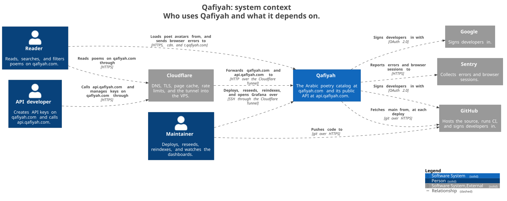
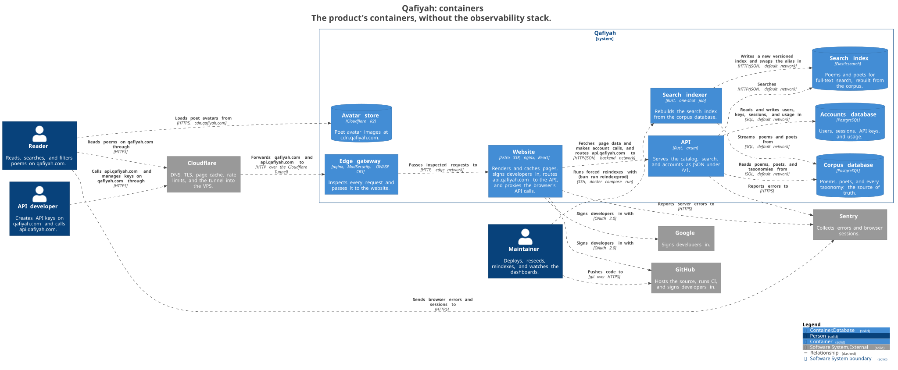
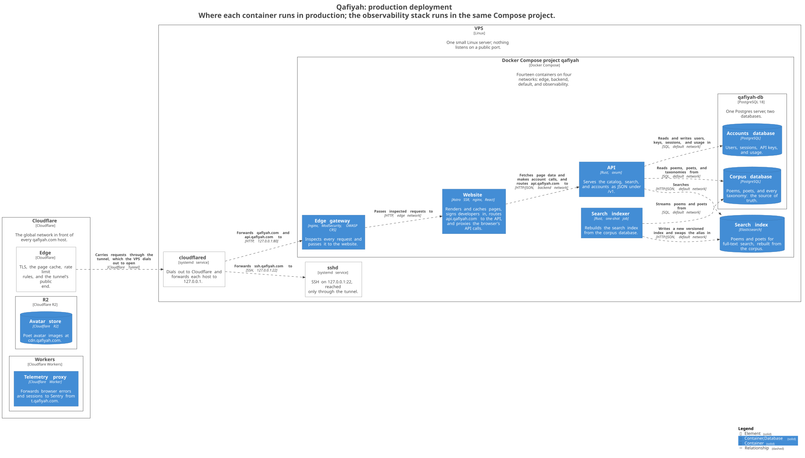
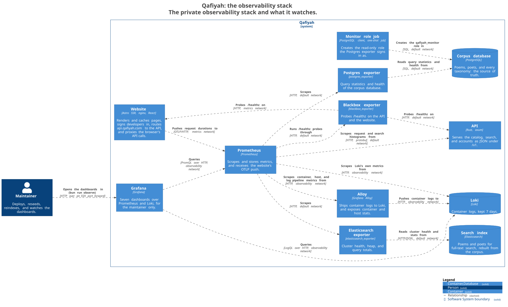
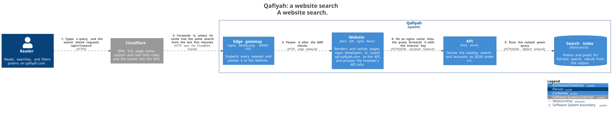
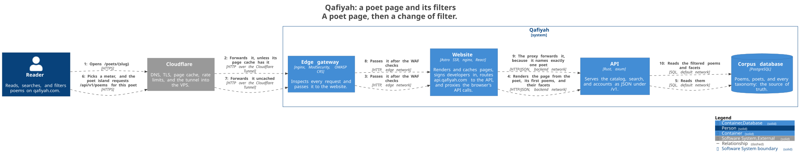
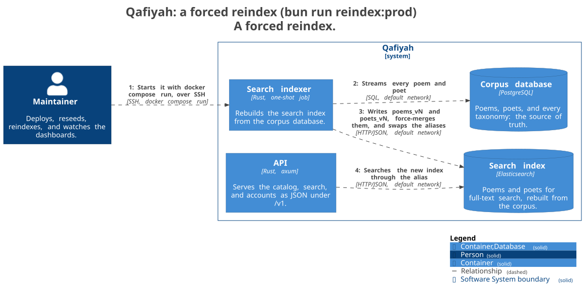
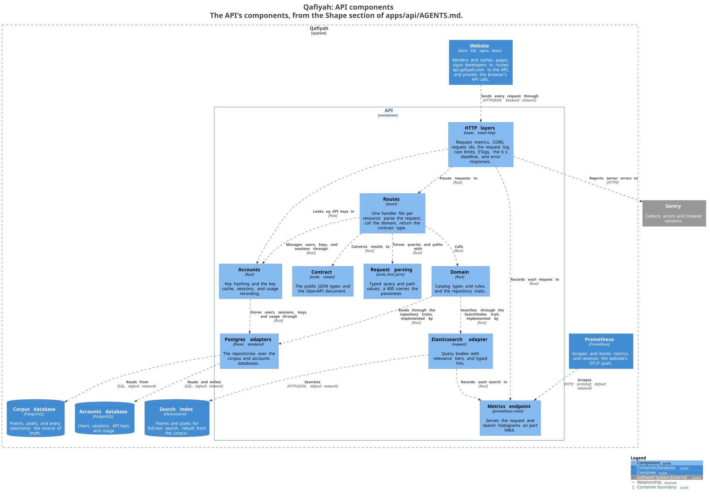
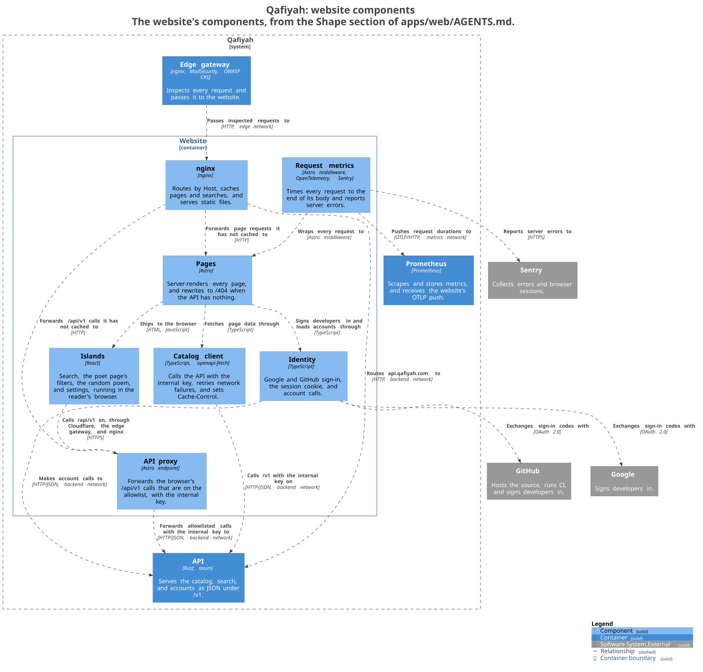

# Topology

A diagram-first map of the whole system: who uses it, what runs where, and what talks to what. Each section links to the doc that carries the depth; this page's job is the big picture.

The diagrams follow the [C4 model](https://c4model.com) and are drawn from one model, `docs/architecture/workspace.dsl`: `bun run docs:diagrams` renders each of its views to an SVG in `docs/architecture/generated/structurizr/`. Change the model, never the SVGs; CI fails when they no longer match it (the `diagrams` phase, "CI/CD topology" below).

> Same rule as `docs/deployment/README.md`: this file and the model stay secret-free. No credentials, tokens, real IPs, or Cloudflare account or tunnel IDs.

## System context

Readers and API developers reach Qafiyah through Cloudflare. Poet avatars and browser error reports go straight to the two parts of Qafiyah that Cloudflare hosts (`cdn.` and `t.qafiyah.com`), and page views go to PostHog through its managed proxy (`ix.qafiyah.com`). Developers sign in with Google or GitHub.

## Containers

Everything except the avatar store and the telemetry proxy runs in one `docker compose` project on the VPS, on five networks:

- `edge`: the edge gateway and the website.
- `backend`: the website and the API.
- `default`: the API, Postgres, Elasticsearch, the search indexer, the monitor-role job, the three exporters, and Prometheus.
- `observability`: Prometheus, Grafana, Loki, and Alloy.
- `metrics`: the website, Prometheus, and the blackbox exporter, for the website's metrics push and its health probe.

The website shares no network with Postgres or Elasticsearch, and the API trusts forwarded visitor addresses only from `backend`, which carries nothing but the website and the API. Three hosts never touch the VPS, the WAF, or the Compose stack:

- `cdn.qafiyah.com` serves poet avatar images straight from R2 (`poets/<slug>/avatar.webp`). See `data/avatars/README.md`.
- `ix.qafiyah.com` is PostHog's own managed reverse proxy, provisioned on the Cloudflare side; there's no code for it in this repo.
- `t.qafiyah.com` is `apps/telemetry-proxy`, a first-party Worker that forwards browser error and session telemetry to Sentry. Details: `apps/telemetry-proxy/AGENTS.md`.

## Production deployment

Nothing is reachable inbound, SSH included: `cloudflared` dials out to Cloudflare, every request arrives through the tunnel, and every listener binds to loopback. The observability containers run in the same Compose project (next section). A dev copy of the stack shares the VPS under its own project, `qafiyah-dev`, with its own containers, ports, and volumes. Mechanics, the zero-downtime rolling deploy, and the security posture: `docs/deployment/architecture.md`.

## Observability

The observability stack is private: Grafana listens on loopback and is reached with `bun run observe`, an SSH port forward over the tunnel. Dashboards, retention, and what each exporter reads: `apps/observability/AGENTS.md`. Ports, healthchecks, and per-service details: `docs/deployment/services.md`.

## Flows

### A website search

Cloudflare never caches `/api/`, so the website's nginx is the one shared cache for searches. The browser never holds an API key: the website's proxy forwards only allowlisted paths and adds the internal key itself (`docs/exceptions.md`, "Two API clients, and no key ever reaches the browser"). How ranking works: `docs/search.md`.

### A poet page and its filters

The first render is server-side. After that, picking a meter, rhyme, or theme refetches the list in place through the same proxy, which forwards `poems` and `poems/facets` only for a request that names exactly one poet (`docs/exceptions.md`, "The poet page's poem list updates in place").

### A forced reindex

The indexer builds a new versioned index and swaps the alias onto it only when it is complete, so searches keep answering from the old index until then. When and how to force one: `apps/search-indexer/AGENTS.md` and `docs/deployment/services.md`.

## Components

### API

Drawn from the "Shape" section of `apps/api/AGENTS.md`, which says what each part owns.

### Website

Drawn from the "Shape" section of `apps/web/AGENTS.md`.

## Data topology

Three independent stores, different roles:

- **Postgres**: source of truth for poems, poets, and every taxonomy table.
- **Elasticsearch**: derived search index, fully rebuilt from Postgres by `search-indexer`.
  Nothing backs it up directly, `bun run reindex`/`reindex:prod` regenerates it from Postgres on
  demand.
- **R2**: object storage for poet avatar images, independent of Postgres (referenced by
  `poet.has_avatar`, not stored in it).

`data/` mirrors the two stores that can't be trivially regenerated:

- `data/db/`: versioned, encrypted Postgres dump snapshots. Automated (`bun run db:*`,
  self-seeding). See `data/db/README.md` and `data/db/MAINTAINERS_GUIDE.md`.
- `data/avatars/`: versioned, encrypted avatar-zip snapshots, same directory-naming and
  encryption pattern as `data/db/`, but manual today, no dedicated scripts yet. See
  `data/avatars/README.md`.

## Codebase topology

| Package                | Language                                    | Uses                                    |
| ---------------------- | ------------------------------------------- | --------------------------------------- |
| `apps/api`             | Rust                                        | `crates/elasticsearch`, `crates/corpus` |
| `apps/search-indexer`  | Rust                                        | `crates/elasticsearch`, `crates/corpus` |
| `apps/web`             | TypeScript (Astro + React)                  | `packages/tsconfig`, `config.ts`        |
| `apps/inspector`       | TypeScript, dev-only                        | `packages/tsconfig`, `config.ts`        |
| `apps/telemetry-proxy` | TypeScript (Cloudflare Worker)              | `packages/tsconfig`                     |
| `apps/edge-gateway`    | nginx config                                | nothing                                 |
| `apps/observability`   | Prometheus, Loki, Alloy, and Grafana config | nothing                                 |

Turborepo orchestrates the TypeScript workspace (`apps/*` + `packages/*`); a separate Cargo
workspace covers the Rust side (`apps/api`, `apps/search-indexer`, `crates/elasticsearch`, `crates/corpus`).
`apps/edge-gateway` is config only (no build step, an nginx image plus a template override), and
so is `apps/observability` (Prometheus, Loki, Alloy, and Grafana images plus their config and dashboards).
Conventions: `docs/code-conventions.md`, `docs/typescript-conventions.md`,
`docs/rust-conventions.md`. Each component's `AGENTS.md` is listed in `README.md` ("Documentation map").

## CI/CD topology

- **Every push and PR to `main`** (`.github/workflows/ci.yml`): `bun run ci --no-docker` (static checks, types and repo checks, TypeScript and Rust tests, clippy, and the contract snapshots) always runs. Each Docker phase (`--phase db`, `origin`, and `stack`: the database-backed tests, the dev smoke with its Schemathesis run of every documented API example, and the stack smoke) runs as its own job only when the change touches something that phase uses. A fourth, `diagrams` (`bun run docs:diagrams:check`, which regenerates the diagrams on this page and compares them with the committed SVGs), runs only when `docs/architecture/` or `scripts/docs/` changes. A `changes` job matches the changed files against per-phase skip lists with `dorny/paths-filter`: a push that touches only docs, agent guides, repo templates, lint config only the gate reads, or encrypted files (secrets, production dumps, avatars) runs the gate alone, and a web-only change skips `db`. A path on no skip list runs every phase, and a manual run (`workflow_dispatch`) runs them all. Every job checks out sparsely, leaving out the encrypted production dumps and avatars (about 2.2 GB) and keeping the committed 100-poem sample the Docker phases run on, so they need no secrets. `.github/workflows/gitleaks.yml` scans every push and PR for committed secrets. `.github/workflows/labeler.yml` adds component and topic labels to every PR from the files it changes, by the rules in `.github/labeler.yml` (`actions/labeler` on `pull_request_target`, which reads the changed-file list and the rules through the API and never checks out the PR's code).
- **Docker images are built on demand** (`.github/workflows/images.yml`, `workflow_dispatch`): one matrix job per service, build-only, nothing is pushed to a registry. Locally, `bun run build:images` builds the same images on their own; `bun run ci` builds them as part of the stack smoke.
- **Merging to `main` does not deploy.** Production deploy is a separate, manual, ordered step (`bun run deploy`, runbook in `.claude/skills/deploy/SKILL.md`) that refuses a commit whose CI run on `main` did not pass: it SSHes to the VPS, rebuilds images from source there, and rolls `api`/`web` with zero downtime. See `docs/deployment/README.md`.

## External services

| Service    | Role                                                                                 | Reached via                                                 |
| ---------- | ------------------------------------------------------------------------------------ | ----------------------------------------------------------- |
| Cloudflare | DNS, TLS, Tunnel (ingress), R2 (object storage), Workers, cache and rate limit rules | all subdomains, `cdn.`, `t.`                                |
| Sentry     | Error/session tracking for api + web                                                 | directly from the servers; `t.qafiyah.com` from the browser |
| PostHog    | Product analytics                                                                    | `ix.qafiyah.com` (Cloudflare-managed)                       |
| GitHub     | Source hosting, Actions CI, secret scanning, developer sign-in                       | `.github/workflows/`; OAuth from the website                |
| Google     | Developer sign-in                                                                    | OAuth from the website                                      |

## See also

- `docs/architecture/workspace.dsl`: the C4 model these diagrams are drawn from
- `README.md`: component overview and quick start
- `AGENTS.md`: repo layout and conventions index
- `docs/deployment/README.md`: deploy/ops entry point (splits into the `docs/deployment/*` files linked above)
- `data/README.md`: the two `data/` subsystems
